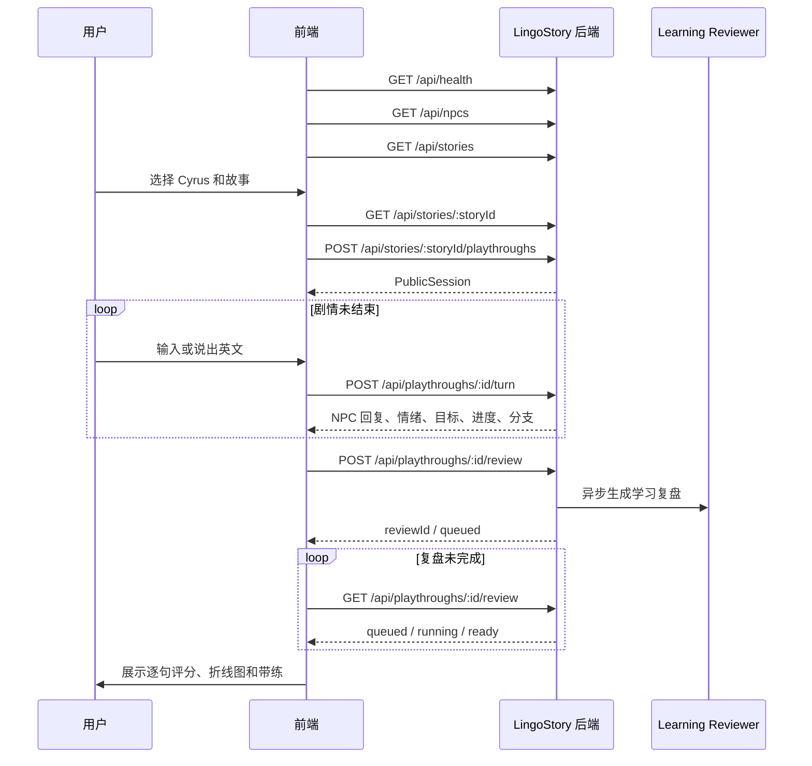

# LingoStory 前后端联调接口契约

> 文档版本：0.1
> 适用范围：当前 Cyrus「拿错了老板的午饭」前端 Demo 与 LingoStory TypeScript 后端
> 后端基线：`main` / `e5d06b92`
> 状态：联调草案，可直接拆分开发任务

## 1. 目标与范围

本契约用于把当前前端中的 NPC、固定四轮剧情、模拟回复、模拟评分与真实后端连接起来。

本轮优先复用后端现有 `/api` 路由，不整体改成 `/api/v1`，以减少联调成本。新增字段应保持向后兼容，前端不得依赖响应里的 `debug` 数据。

分三个阶段：

- **P0 剧情联通**：NPC/故事加载、创建会话、真实文本回合、情绪立绘、动态进度、会话恢复。
- **P1 学习复盘**：逐句评分、问题分析、自然表达改写、语块带练、折线图数据。
- **P2 真实语音**：麦克风、ASR、TTS，以及基于语音时序的流畅度评分。

### 1.1 工作量分配原则

接口里的“目标返回结构”不等于所有字段都要阻塞第一次联调。

- **P0 最短联调以改前端为主**：后端已有 NPC、故事、playthrough、文本回合、分支、结局和持久化接口。前端负责从假状态机切换到真实 API。
- **P0 后端只做三个阻塞项**：提供可访问的 API 地址、增加 Cyrus 故事版本、公开返回规范化 `emotionId`。
- `progress`、`npcId`、稳定错误码、历史事件情绪等属于接口加固，可以在第一版跑通后补。
- **P1 会偏后端**：当前后端明确不分析语法、词汇、流畅度和地道度，学习复盘数据必须新增生成与存储能力。
- **P2 再次以前端为主**：浏览器完成麦克风、VAD、ASR 和 TTS，后端主要接收最终文本和可选语音证据。

粗略工作量分配：

| 阶段 | 前端 | 后端 |
| --- | ---: | ---: |
| P0 剧情联通 | 70% | 30% |
| P1 学习复盘 | 40% | 60% |
| P2 真实语音 | 70% | 30% |

## 2. 数据归属

| 数据 | 负责方 | 说明 |
| --- | --- | --- |
| NPC ID、人设、关系、声线 | 后端 | 决定模型如何扮演 NPC |
| NPC 选择图、六种情绪立绘 | 前端，P1 可迁移到后端素材清单 | P0 使用 `npcId` 映射本地素材 |
| 故事标题、简介、开场、剧情状态机 | 后端 | 前端不再维护固定 `rounds` |
| 当前目标、提示、剩余回合、剧情进度 | 后端 | 前端只负责展示 |
| 用户原句、NPC 回复、NPC 动作、分支结果 | 后端 | `clientTurnId` 保证幂等 |
| NPC 当前语义情绪 | 后端 | 必须规范化成前端支持的六种值 |
| 对话中文翻译 | 后端可选 | P0 可以暂不展示或由前端隐藏 |
| 逐句学习评分和反馈 | 后端 | 由独立 Learning Reviewer 生成 |
| 折线图、分数卡、复盘交互 | 前端 | 使用后端返回的逐句分数绘制 |
| ASR/TTS | P2 优先复用浏览器语音模块 | 当前后端只接收文本 |

## 3. 推荐部署方式

推荐前端和 API 使用同源地址：

```text
https://lingostory.example.com/       前端
https://lingostory.example.com/api/*  后端
```

前端默认：

```js
const API_BASE_URL = "";
```

这样可以避免 `file://`、跨域 Cookie 和 CORS 问题。开发环境如果分别运行前后端，应通过开发代理把 `/api` 转发到 `http://127.0.0.1:8790`。

## 4. 总体调用流程



## 5. 通用约定

### 5.1 请求与响应

- 编码：UTF-8。
- 数据格式：`application/json`。
- 时间：ISO 8601，例如 `2026-07-31T12:24:00.000Z`。
- 所有 ID 均作为不透明字符串使用。
- 前端超时建议：普通查询 10 秒，AI 回合 45 秒，复盘生成使用异步轮询。
- 前端只消费本契约声明的公开字段，不消费 `debug`。

### 5.2 错误格式

保留后端当前的 `error` 字符串，并增加稳定错误码：

```json
{
  "error": "This session has already ended",
  "code": "SESSION_ENDED",
  "retryable": false,
  "issues": []
}
```

建议错误码：

| HTTP | code | 场景 |
| --- | --- | --- |
| 400 | `VALIDATION_ERROR` | 请求字段错误 |
| 404 | `NPC_NOT_FOUND` | NPC 不存在 |
| 404 | `STORY_NOT_FOUND` | 故事不存在 |
| 404 | `PLAYTHROUGH_NOT_FOUND` | 会话不存在 |
| 409 | `SESSION_ENDED` | 已结束的会话再次提交 |
| 409 | `TURN_IN_PROGRESS` | 同一会话正在处理另一回合 |
| 429 | `RATE_LIMITED` | 上游或服务限流 |
| 502 | `AGENT_UPSTREAM_ERROR` | 模型服务失败 |
| 503 | `MAAS_NOT_CONFIGURED` | MAAS 未配置 |
| 504 | `AGENT_TIMEOUT` | 模型调用超时 |

## 6. 公共数据类型

### 6.1 EmotionId

前后端统一只使用六种 UI 情绪：

```ts
type EmotionId =
  | "neutral"
  | "happy"
  | "sad"
  | "angry"
  | "nervous"
  | "surprised";
```

后端现有情绪的推荐映射：

| 后端现有值 | 公开 EmotionId |
| --- | --- |
| `focused` | `neutral` |
| `impatient` | `angry` |
| `confused` | `surprised` |
| `frustrated` | `angry` |
| `concerned` | `nervous` |
| `reserved` | `neutral` |
| `neutral` | `neutral` |

内部可以保留更细的情绪，公开 API 必须返回规范化值。

### 6.2 PublicSession

```ts
type PublicSession = {
  sessionId: string;
  storyId: string;
  storyTitle: string;
  playerRole: string;
  opening: string;
  targetLanguage: "en";
  activeNpc: {
    id: string;
    name: string;
    emotionId: EmotionId;
    voiceProfile: {
      provider: "qwen3-tts";
      model: string;
      voiceId: string;
      language: "English";
      gender: "female" | "male" | "neutral";
      style: string;
    };
  };
  currentBeatId: string | null;
  currentGoal: string | null;
  currentHint?: {
    level: 1 | 2;
    text: string;
  };
  turnInBeat: number;
  maxTurns: number;
  remainingTurns: number;
  progress: {
    current: number;
    total: number;
    percent: number;
  };
  phase: "active" | "ended";
  ending?: "good" | "mixed" | "bad";
  events: PublicEvent[];
};
```

`progress.current` 从 1 开始；`progress.percent` 表示已经完成的剧情进度。进入第一步时为 0，故事结束时必须为 100。动态分支故事中，具体计算方式由后端统一决定。

### 6.3 PublicEvent

```ts
type PublicEvent = {
  id: string;
  type:
    | "session_started"
    | "user_utterance"
    | "npc_utterance"
    | "npc_action"
    | "hint_shown";
  actor: "user" | "npc" | "system";
  text?: string;
  stageText?: string;
  emotionId?: EmotionId;
  createdAt: string;
};
```

## 7. P0 剧情接口

### 7.1 健康检查

```http
GET /api/health
```

成功：

```json
{
  "ok": true,
  "provider": "maas",
  "activeModel": "azure-gpt-56-sol-12-sc/gpt-5.6-sol",
  "database": "sqlite",
  "protocolVersion": "1.2"
}
```

前端行为：

- `200 + ok=true`：允许开始故事。
- `503`：展示“AI 服务暂不可用”，保留重试入口。

### 7.2 获取 NPC 列表

```http
GET /api/npcs
```

成功：

```json
{
  "npcs": [
    {
      "id": "cyrus",
      "displayName": "Cyrus",
      "currentVersion": 1,
      "status": "active",
      "profile": {
        "npcId": "cyrus",
        "version": 1,
        "displayName": "Cyrus",
        "role": "大型科技公司高管",
        "personality": "Busy, direct, and fair.",
        "persona": "Cyrus values honesty and clear action.",
        "speakingStyle": "Professional and direct.",
        "relationship": "Cyrus is the user's manager.",
        "voiceProfile": {
          "provider": "qwen3-tts",
          "model": "Qwen3-TTS-12Hz-1.7B-CustomVoice",
          "voiceId": "aiden",
          "language": "English",
          "gender": "male",
          "style": "professional, direct, composed"
        },
        "createdAt": "2026-07-31T04:00:00.000Z"
      },
      "memoryCount": 0
    }
  ]
}
```

P0 的立绘不从接口返回。前端维护：

```js
const NPC_PRESENTATION = {
  cyrus: {
    selectImage: "/assets/npc/cyrus/Cyrus_00_grid_select.png",
    emotions: {
      neutral: "/assets/npc/cyrus/Cyrus_01_neutral.png",
      happy: "/assets/npc/cyrus/Cyrus_02_happy.png",
      sad: "/assets/npc/cyrus/Cyrus_03_sad.png",
      angry: "/assets/npc/cyrus/Cyrus_04_angry.png",
      surprised: "/assets/npc/cyrus/Cyrus_05_surprised.png",
      nervous: "/assets/npc/cyrus/Cyrus_06_nervous.png"
    }
  }
};
```

### 7.3 获取故事列表

```http
GET /api/stories
```

成功：

```json
{
  "stories": [
    {
      "id": "lunch-mixup-cyrus-v1",
      "title": "拿错了老板的午饭",
      "synopsis": "在老板走进办公室之前说明午餐拿错，并处理后续问题。",
      "topic": "workplace",
      "npc": "Cyrus",
      "npcId": "cyrus",
      "createdAt": "2026-07-31T04:00:00.000Z",
      "playCount": 0,
      "endingDistribution": {
        "good": 0,
        "mixed": 0,
        "bad": 0
      },
      "protocolVersion": "1.2",
      "presentation": {
        "episode": "EP.01",
        "level": "A2-B1",
        "estimatedMinutes": 3
      }
    }
  ]
}
```

与当前后端相比，P0 必须新增 `npcId`。`presentation` 可以先由前端使用默认值，后端后续补齐。

### 7.4 获取故事详情

```http
GET /api/stories/:storyId
```

成功：

```json
{
  "id": "lunch-mixup-cyrus-v1",
  "title": "拿错了老板的午饭",
  "synopsis": "在老板走进办公室之前说明午餐拿错，并处理后续问题。",
  "playerRole": "你是 Cyrus 的下属。",
  "opening": "你刚发现自己和 Cyrus 的午餐拿反了。",
  "targetLanguage": "en",
  "npc": {
    "id": "cyrus",
    "displayName": "Cyrus",
    "role": "大型科技公司高管",
    "relationship": "Cyrus is the user's manager.",
    "voiceProfile": {
      "provider": "qwen3-tts",
      "model": "Qwen3-TTS-12Hz-1.7B-CustomVoice",
      "voiceId": "aiden",
      "language": "English",
      "gender": "male",
      "style": "professional, direct, composed"
    }
  },
  "status": "published",
  "createdAt": "2026-07-31T04:00:00.000Z"
}
```

前端不得请求或依赖 `?debug=1` 下的完整 `storyPackage`。

### 7.5 创建剧情会话

```http
POST /api/stories/:storyId/playthroughs
Content-Type: application/json
```

请求体为空：

```json
{}
```

成功：`201 Created`

```json
{
  "session": {
    "sessionId": "4a8f9b91-4af7-42d0-86a2-e4a99462417c",
    "storyId": "lunch-mixup-cyrus-v1",
    "storyTitle": "拿错了老板的午饭",
    "playerRole": "你是 Cyrus 的下属。",
    "opening": "你刚发现自己和 Cyrus 的午餐拿反了。",
    "targetLanguage": "en",
    "activeNpc": {
      "id": "cyrus",
      "name": "Cyrus",
      "emotionId": "neutral",
      "voiceProfile": {
        "provider": "qwen3-tts",
        "model": "Qwen3-TTS-12Hz-1.7B-CustomVoice",
        "voiceId": "aiden",
        "language": "English",
        "gender": "male",
        "style": "professional, direct, composed"
      }
    },
    "currentBeatId": "intercept",
    "currentGoal": "在 Cyrus 进门前叫住他。",
    "turnInBeat": 0,
    "maxTurns": 1,
    "remainingTurns": 1,
    "progress": {
      "current": 1,
      "total": 6,
      "percent": 0
    },
    "phase": "active",
    "events": []
  }
}
```

后端当前可能同时返回 `debug`。前端必须忽略，生产环境建议移除。

### 7.6 提交一轮对话

```http
POST /api/playthroughs/:playthroughId/turn
Content-Type: application/json
```

请求：

```json
{
  "clientTurnId": "turn_20260731_0001",
  "text": "Wait, Cyrus—please don't go into your office yet."
}
```

规则：

- `clientTurnId` 由前端生成，同一次重试必须复用原值。
- 同一个 `clientTurnId` 重复请求必须返回相同结果，不能推进两次剧情。
- `text` 当前只允许英文有效表达，长度 1–2000。

成功：

```json
{
  "clientTurnId": "turn_20260731_0001",
  "session": {
    "sessionId": "4a8f9b91-4af7-42d0-86a2-e4a99462417c",
    "storyId": "lunch-mixup-cyrus-v1",
    "storyTitle": "拿错了老板的午饭",
    "playerRole": "你是 Cyrus 的下属。",
    "opening": "你刚发现自己和 Cyrus 的午餐拿反了。",
    "targetLanguage": "en",
    "activeNpc": {
      "id": "cyrus",
      "name": "Cyrus",
      "emotionId": "surprised",
      "voiceProfile": {
        "provider": "qwen3-tts",
        "model": "Qwen3-TTS-12Hz-1.7B-CustomVoice",
        "voiceId": "aiden",
        "language": "English",
        "gender": "male",
        "style": "professional, direct, composed"
      }
    },
    "currentBeatId": "explain",
    "currentGoal": "告诉 Cyrus 午餐为什么拿错了。",
    "turnInBeat": 0,
    "maxTurns": 2,
    "remainingTurns": 2,
    "progress": {
      "current": 2,
      "total": 6,
      "percent": 17
    },
    "phase": "active",
    "events": []
  },
  "npc": {
    "id": "cyrus",
    "name": "Cyrus",
    "utterance": "Okay, I'm stopping. What happened?",
    "translationZh": "好，我停下了。发生什么事了？",
    "emotionId": "surprised",
    "actionId": "stop",
    "stageText": "Cyrus stops at the office door and turns toward you.",
    "voiceProfile": {
      "provider": "qwen3-tts",
      "model": "Qwen3-TTS-12Hz-1.7B-CustomVoice",
      "voiceId": "aiden",
      "language": "English",
      "gender": "male",
      "style": "professional, direct, composed"
    }
  },
  "controller": {
    "fromBeatId": "intercept",
    "toBeatId": "explain",
    "transitionId": "intercept_success",
    "outcome": "success",
    "reason": "task_completed"
  },
  "fallbackUsed": false
}
```

P0 目标契约字段：

- `clientTurnId`
- `session.activeNpc.emotionId`
- `session.progress`
- `npc.emotionId`

第一次联调只阻塞于 `npc.emotionId`；`clientTurnId` 可由前端保留请求值，`progress` 缺失时前端隐藏总进度，`session.activeNpc.emotionId` 可先使用最近一轮 `npc.emotionId` 更新。

`translationZh` 为可选字段。没有返回时，前端隐藏中文翻译区域，不显示假翻译。

### 7.7 恢复剧情会话

```http
GET /api/playthroughs/:playthroughId
```

成功响应为 `PublicSession`。

用途：

- 页面刷新后恢复当前任务、目标、提示和 NPC 情绪。
- 根据 `events` 恢复对话记录。
- `phase=ended` 时直接进入结局/复盘流程。

## 8. P1 学习复盘接口

剧情 Judge 继续只负责“剧情是否被推动”，不得同时承担英语老师职责。新增独立 Learning Reviewer。

### 8.1 创建复盘任务

```http
POST /api/playthroughs/:playthroughId/review
Content-Type: application/json
```

请求：

```json
{
  "locale": "zh-CN",
  "dimensions": ["fluency", "naturalness", "accuracy"]
}
```

只有 `session.phase=ended` 后允许创建。

成功：`202 Accepted`

```json
{
  "reviewId": "review_01K1...",
  "playthroughId": "4a8f9b91-4af7-42d0-86a2-e4a99462417c",
  "status": "queued",
  "pollAfterMs": 800
}
```

重复调用应返回已有复盘任务，不能重复计费。

### 8.2 查询复盘结果

```http
GET /api/playthroughs/:playthroughId/review
```

处理中：

```json
{
  "reviewId": "review_01K1...",
  "playthroughId": "4a8f9b91-4af7-42d0-86a2-e4a99462417c",
  "status": "running",
  "pollAfterMs": 800
}
```

完成：

```json
{
  "reviewId": "review_01K1...",
  "playthroughId": "4a8f9b91-4af7-42d0-86a2-e4a99462417c",
  "status": "ready",
  "metricMode": "text_only",
  "overall": {
    "score": 81,
    "fluency": 80,
    "naturalness": 75,
    "accuracy": 84
  },
  "weakestSentenceId": "sentence_evt_0014",
  "suggestionZh": "优先把意思正确升级为这个场景里更自然、完整的表达。",
  "sentences": [
    {
      "id": "sentence_evt_0002",
      "eventId": "evt_0002",
      "order": 1,
      "beatId": "intercept",
      "labelZh": "叫住对方",
      "text": "Wait, Cyrus—please don't go into your office yet.",
      "scores": {
        "score": 94,
        "fluency": 92,
        "naturalness": 94,
        "accuracy": 96
      },
      "level": "natural",
      "grammarIssues": [],
      "vocabularyIssues": [],
      "feedbackZh": "称呼、请求和时间压力都表达得很清楚。",
      "rewrite": "Wait, Cyrus—please don't go into your office yet.",
      "chunks": [
        "Wait, Cyrus",
        "please don't go in",
        "yet"
      ]
    },
    {
      "id": "sentence_evt_0014",
      "eventId": "evt_0014",
      "order": 4,
      "beatId": "close",
      "labelZh": "确认收尾",
      "text": "So... we are good?",
      "scores": {
        "score": 55,
        "fluency": 58,
        "naturalness": 47,
        "accuracy": 60
      },
      "level": "needs_work",
      "grammarIssues": [],
      "vocabularyIssues": [
        {
          "phrase": "we are good",
          "messageZh": "可以理解，但动作还没完成就询问是否结束，语气显得偏急。",
          "suggestion": "sorry again"
        }
      ],
      "feedbackZh": "先说明补救动作已经完成，再结束对话会更自然。",
      "rewrite": "I've reordered it. It'll be here in twenty minutes—sorry again.",
      "chunks": [
        "I've reordered it",
        "it'll be here in twenty minutes",
        "sorry again"
      ]
    }
  ],
  "createdAt": "2026-07-31T04:30:00.000Z"
}
```

说明：

- 前端折线图直接使用 `sentences[].scores`。
- `naturalness` 在 UI 中显示为“地道度”。
- `metricMode=text_only` 表示只根据转写文本评价。
- P2 接入语音时可以返回 `metricMode=speech`，并加入停顿、语速、重说等证据。
- `sentence.id` 稳定，用于选择重点句、带练和前端定位。

## 9. P2 语音接口边界

当前后端回合接口只接收文本。P2 推荐：

1. 浏览器完成 VAD 和 ASR。
2. 把最终英文转写提交到 `/turn`。
3. 使用 `npc.voiceProfile` 和 `npc.utterance` 播放 TTS。
4. 如果需要真实口语流畅度，复盘请求还应保存或提交以下语音元数据：

```ts
type SpeechEvidence = {
  durationMs: number;
  speechDurationMs: number;
  pauseCount: number;
  restartCount: number;
  asrConfidence?: number;
  wordTimestamps?: Array<{
    word: string;
    startMs: number;
    endMs: number;
  }>;
};
```

P0/P1 不新增后端音频上传接口。

## 10. 前端修改清单

### P0：前端是主要改造方

#### `site/app.js`

- 新增 `apiRequest(path, options)`，统一处理 JSON、超时、错误码和重试。
- 新增应用状态：
  - `selectedNpcId`
  - `selectedStoryId`
  - `playthroughId`
  - `session`
  - `pendingClientTurnId`
- 将 `npcLibrary` 改为：
  - 后端返回的语义 NPC 数据。
  - 前端 `NPC_PRESENTATION` 素材映射。
- 删除固定 `rounds` 对剧情推进的控制权。
- 用 `session.currentGoal/currentHint/remainingTurns` 渲染任务区。
- 后端尚未返回 `progress` 时，第一版隐藏总进度数字，只展示当前任务和当前 Beat 剩余轮次。
- 将 `choosePath(good|mid|bad)` 替换为 `submitTurn(text)`。
- 生成稳定 `clientTurnId`；失败重试时复用同一个 ID。
- 使用 `npc.utterance`、`npc.stageText`、`npc.emotionId` 更新对话与立绘。
- 使用 `controller.outcome` 仅做轻量状态反馈，不再让用户手动选择 good/mid/bad。
- 页面刷新时根据保存的 `playthroughId` 调用恢复接口。
- 不读取 `debug`。

#### `site/index.html`

- 增加真实文本输入框和发送按钮。
- 保留麦克风按钮，但 P0 点击后显示“语音功能即将接入”或隐藏。
- 删除或仅在开发模式显示三个模拟路径按钮。
- 增加：
  - API 加载状态。
  - 回合提交中状态。
  - 失败重试按钮。
  - 复盘生成中状态。

#### `site/styles.css`

- 增加输入框、发送按钮、禁用态、加载态、错误提示和重试样式。
- 进度条支持后端返回的动态百分比，不再假定四轮。

#### 构建与运行

- 不再使用 `file://` 作为真实联调入口。
- 配置同源 `/api`，或在开发服务器中配置 `/api` 代理。
- 构建时保留 `NPC_PRESENTATION` 中的图片相对路径。

#### 测试

- API 客户端错误处理测试。
- `clientTurnId` 幂等重试测试。
- 动态剧情超过四轮时的 UI 测试。
- 刷新恢复会话测试。
- ended 会话进入结局页测试。

### P1：学习复盘

- 删除 `coaching` 和 `scoreProfiles` 假数据。
- `showEnding()` 改为：
  1. 展示剧情结局。
  2. 创建复盘任务。
  3. 轮询复盘结果。
  4. `ready` 后渲染复盘。
- 折线图的 X 轴改为按 `sentences.length` 动态计算；不能写死四个点。
- 重点句区域使用 `weakestSentenceId`。
- 带练语块使用 `sentences[].chunks`。
- 复盘失败时仍展示剧情结局，并提供“重新生成复盘”。

### P2：真实语音

- 接入真实麦克风、VAD、ASR。
- ASR 最终英文转写进入与文本输入完全相同的 `submitTurn(text)`。
- 使用 `voiceProfile` 播放 NPC TTS。
- 采集并提交语音时序证据，升级为真实口语流畅度评分。

## 11. 后端修改清单

### P0-MVP：后端只完成三个联调阻塞项

#### 1. 提供可访问的 API

- 推荐由后端同源托管前端静态文件。
- 如果前后端分开运行，只需增加明确的 CORS 白名单或开发代理。
- 确认 MAAS 配置完整，`GET /api/health` 返回 `200`。

#### 2. 新增 Cyrus 故事版本

- 不修改已经被历史 playthrough 引用的 `lunch-mixup-v6`。
- 新增不可变故事版本 `lunch-mixup-cyrus-v1`。
- 新故事需要对齐：
  - `activeNpcId`
  - `npcDefinitions`
  - `npcBinding`
  - Cyrus 人设、关系和声线

#### 3. 公开返回规范化情绪

涉及 `server/domain.ts` 与 `server/engine.ts`：

- 为 `PublicSession.activeNpc` 增加 `emotionId`。
- 为 `TurnResponse.npc` 增加 `emotionId`。
- 把内部情绪映射为六种前端 `EmotionId`。
- 第一版不要求中文翻译，不返回时前端隐藏翻译区域。

完成以上三项，前端即可使用后端已有接口跑通真实剧情。

### P0 接口加固：不阻塞第一次联调

#### `server/domain.ts`

- 为 `PublicSession` 增加 `progress`。
- 为 `PublicEvent` 增加可选 `emotionId`。
- 为 `TurnResponse` 增加顶层 `clientTurnId`。
- 为 `TurnResponse.npc` 增加可选 `translationZh`。

#### `server/engine.ts`

- 在 NPC 历史事件中保留情绪，支持刷新恢复。
- 计算并返回动态 `progress`。
- 返回 `clientTurnId`。
- 已结束会话再次提交时返回 `409 SESSION_ENDED`。

#### `server/store.ts`

- `listStories()` 增加稳定 `npcId`，不能只返回 NPC 显示名。
- 确认重复 `clientTurnId` 的缓存结果在服务重启后仍可恢复。
- 会话列表和详情保持现有持久化能力。

#### `server/index.ts`

- 保留现有 `/api` 路径。
- 在统一错误处理中增加 `code` 和 `retryable`。
- 生产环境不返回 `debug`，或至少声明其不属于稳定协议。

#### `server/schemas.ts`

- 为新增公开字段补充 Zod Schema。
- 如果 `translationZh` 暂不实现，保持可选。
- 为响应增加契约测试，避免字段被无意删除。

#### 加固测试

- 创建会话响应契约测试。
- 回合响应契约测试。
- 重复 `clientTurnId` 幂等测试。
- 会话恢复后情绪、任务、进度一致性测试。

### P1：学习复盘

#### 新增 `server/learning-reviewer.ts`

- 读取已结束会话中的所有 `user_utterance`。
- 独立调用模型生成：
  - fluency
  - naturalness
  - accuracy
  - grammar issues
  - vocabulary issues
  - feedback
  - rewrite
  - chunks
- 校验所有分数在 0–100。
- 校验每个句子都能追溯到真实 `eventId`。
- Reviewer 不修改剧情状态和 NPC 记忆。

#### `server/prompts.ts`

- 保留现有剧情 Judge Prompt 不变。
- 新增 Learning Reviewer Prompt。
- 明确：
  - 不因为用户选择“不礼貌/拒绝”的剧情决定而直接扣语法分。
  - 语法正确、地道度和剧情结果相互独立。
  - 反馈使用中文，示例和改写使用英文。

#### `server/schemas.ts`

- 新增 Review Job、Review Result、Sentence Review Schema。
- 严格限制数组长度和模型输出文本长度。

#### `server/store.ts`

- 新增 `learning_reviews` 表，建议字段：
  - `id`
  - `playthrough_id`
  - `status`
  - `request_json`
  - `result_json`
  - `error_json`
  - `created_at`
  - `updated_at`
- `playthrough_id` 建唯一索引，避免重复生成。

#### `server/index.ts`

- 新增：
  - `POST /api/playthroughs/:id/review`
  - `GET /api/playthroughs/:id/review`
- 只有已结束会话允许生成复盘。
- 复盘失败可以安全重试。

#### 测试

- 四句和动态多句对话的复盘测试。
- 空转写、超长转写和模型坏 JSON 测试。
- 分数范围、最弱句引用、eventId 可追溯测试。
- Review Job 幂等测试。

### P2：真实语音

- 复用现有 `src/voice.ts` 的 ASR/TTS 能力，或抽成共享浏览器模块。
- 如果浏览器不能安全直连供应商，再增加后端授权或代理接口。
- 为 Review 增加 `SpeechEvidence`，区分 `text_only` 与 `speech`。

## 12. 联调验收标准

### P0

- NPC 选择页显示 Cyrus，模型也按 Cyrus 人设回复。
- 前端没有固定四轮假数据也能完成故事。
- 用户输入任意英文，而不是选择 good/mid/bad。
- 每轮返回正确 NPC 立绘情绪。
- 同一 `clientTurnId` 重试不会重复推进剧情。
- 刷新页面后可以恢复对话、NPC 情绪和当前任务。
- 故事结束后能显示后端真实 ending。
- 前端源码不读取 `debug`。

### P1

- 复盘句子数量等于有效用户表达数量。
- 每句都有三项分数，可直接绘制折线图。
- 最弱句、改写、语块来自后端真实结果。
- 复盘失败不影响故事结局和历史记录。
- 同一 playthrough 不会重复创建多个付费复盘任务。

### P2

- 用户语音最终进入与文本相同的回合接口。
- NPC 回复可以被打断和重新播放。
- `metricMode=speech` 时，流畅度包含真实语音证据。
